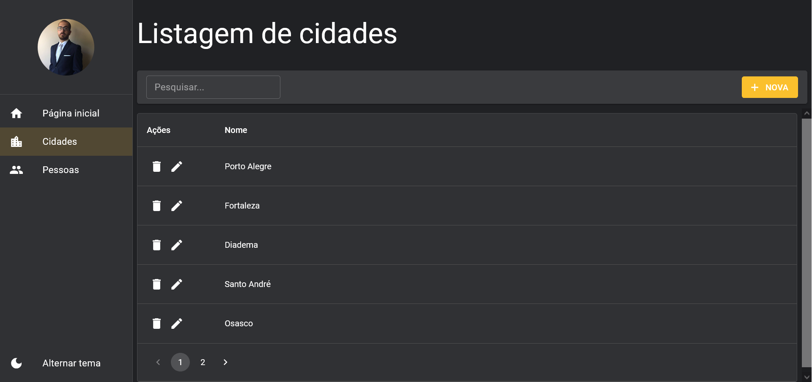

# Aplicação de Cadastro de Pessoas e Cidades usando ReactJS, TypeScript e Material UI, disponibilizado pelo canal Lucas Souza Dev

## Visão Geral

### Screenshot

## Meu processo

### Construído com

-   HTML5
-   CSS3
-   JavaScript
-   TypeScript
-   React
-   Axios
-   Material UI
-   Yup
-   json-server

### Como utilizar

Inicialmente, execute 'yarn install' para instalar as dependências necessárias.

Após isso, execute 'yarn mock' no terminal para iniciar o servidor json-server.

Então, abra outro terminal, e execute 'yarn dev' para abrir a aplicação no navegador.

A aplicação possui  três áreas, sendo a primeira destinada a indicar o número total de pessoas e cidades, a segunda a cadastrar, editar e excluir cidades, e a terceira a cadastrar, editar e excluir pessoas, vinculadas às cidades cadastradas.
 
## Autor

-   GitHub - Vinícius dos Santos Verissimo (https://github.com/viniciusdsv93)
